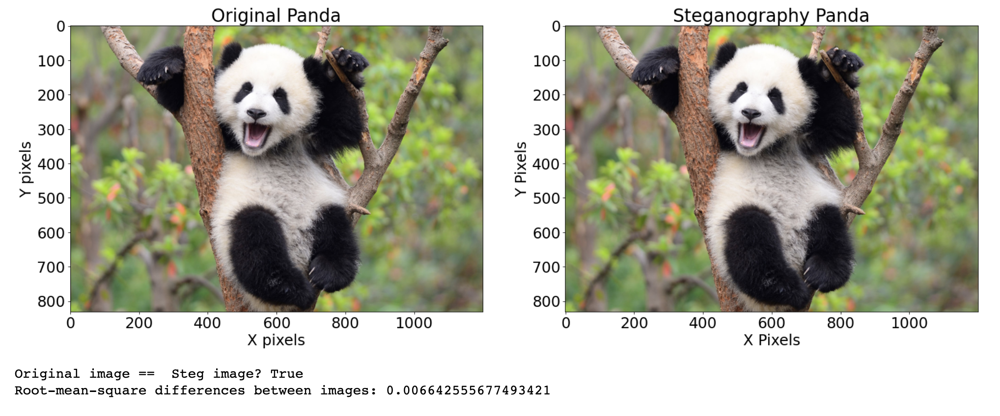
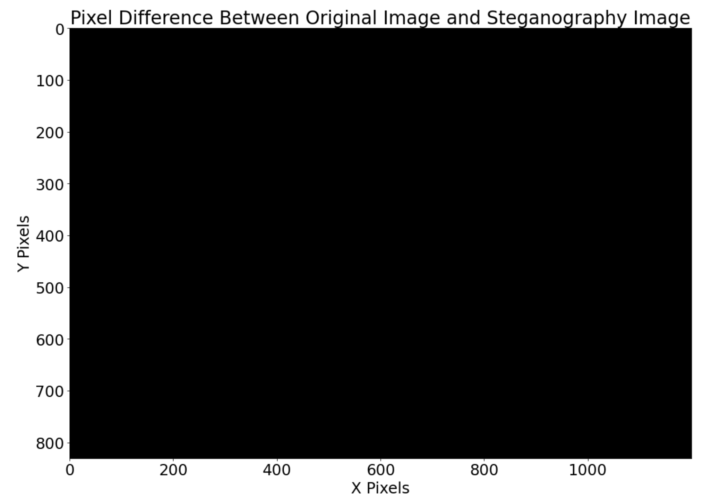
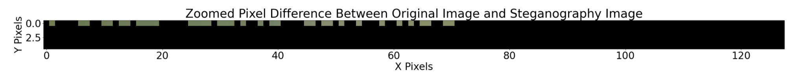

# Camouflage Text in Images with Python

This uses image-based steganography to encode text in images.  While analysis on the image can prove it has been tampered with, this is only possible if you have the ORIGINAL image.  Without the original image there is no way to tell that a message has been injected into the photo.  The notebook provides various functions and demonstrations to illustrate this point so check it out and pay close attention to the plots and images.

# Example of encoding message in a panda image

Above you can see two photos: the original and the steganorgaphy image.  Visually they look identical.  The steganography image in this example has been encoded with a secret message that when decoded reads: "ThiS iS a SeCRet MesSAgE"

If you have the original image that was used to encode the message, it is possible to do a subtraction and inspect for differnces.

Steganography Image - Original Image = 

As you can see above, to the human eye it is incredibly hard to see a pixel differene between the original image, and the image encoded with the secret message.

ZOOMED Steganography Image - Original Image = 

If you zoom in you can visually see the differences with your eyes.  Again, only possible if you have the modified AND the source image.
